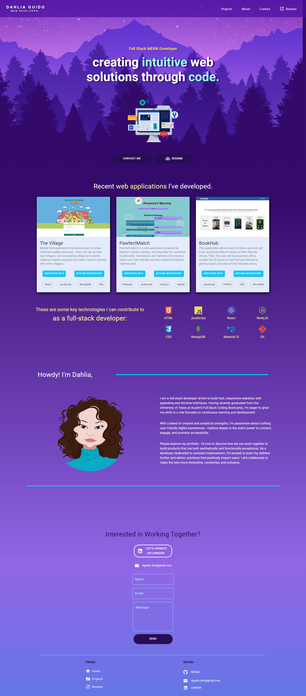

# Dahlia Guido - React Portfolio
> Deployed with GitHub Pages.

### Description 📖

Explore my professional portfolio featuring a diverse range of web development projects. From various technologies to different concepts, this collection highlights my continuous progress and dedication to my coding journey.


[](https://opensource.org/licenses/MIT)

## Table of Contents
  * [Usage](#usage)
  * [Features](#features-✨)
  * [Installation](#installation-💾)
  * [Technologies](#technologies-🛠️)
  * [Dependencies](#dependencies)
  * [Contributing](#contributing)
  * [License](#license)
  * [Questions](#questions)
<br><br>

## Usage
This React application has been deployed using GitHub Pages. The portfolio can be viewed online: 
### [>> Click here to view My Portfolio ➡️](https://cyphernyx.github.io/dahlia-portfolio-site/)

The code can be cloned or downloaded from `https://github.com/CypherNyx/dahlia-portfolio-site.git`




## Features ✨
- Recent projects section - highlights my latest and greatest work
- About me section - provides background info and introduces me
- Resume download - visitors can download a PDF copy of my resume
- Contact form - allows visitors to get in touch directly from the site
- Responsive design - site adapts to mobile, tablet, and desktop layouts
- Easy navigation - intuitive menu and layout for smooth browsing
- Social media links - connects visitors with my other online profiles


## Installation 💾

1. Clone this GitHub repository to your local machine. <br> 
```sh
git clone https://github.com/CypherNyx/dahlia-portfolio-site.git
```
2. Open a terminal or command prompt and navigate to the cloned repository's directory.
3. Run the install command in your terminal
```
npm install
``` 
4. After installing all necessary dependencies, Start your server by running this command on your terminal: 
```
npm start
```
5. The server will start on port 3001. 


## Technologies 🛠️: 
  
  
 

 
 
 


<br>

## Dependencies 
Here is a full list of the dependencies for this application

- react - Front-end JavaScript library
- react-dom - React package for DOM rendering
- @mui/material - Material UI React component library
- @emotion/styled - Styled components
- react-scripts - Create React App build scripts
- @react-pdf/renderer - PDF generation in React
- react-scroll - Scroll animations for React
- @testing-library/react - React component testing utilities
- @emailjs/browser - EmailJS API integration
- @mui/icons-material - Material UI icon library
- @emotion/react - Styled components for CSS-in-JS
- @testing-library/jest-dom - Custom Jest matchers
- web-vitals - Core web vitals metrics

## Contributing
Pull requests are welcome. Please open an issue first to discuss any proposed changes or additions.
<br>

## License
[](https://opensource.org/licenses/MIT)
  
  https://opensource.org/licenses/MIT <br> 
  This project is open source and available under the MIT License.

<br>

  ## Questions
  GitHub [CypherNyx](https://github.com/CypherNyx)<br>
  Email: dguido.dev@gmail.com